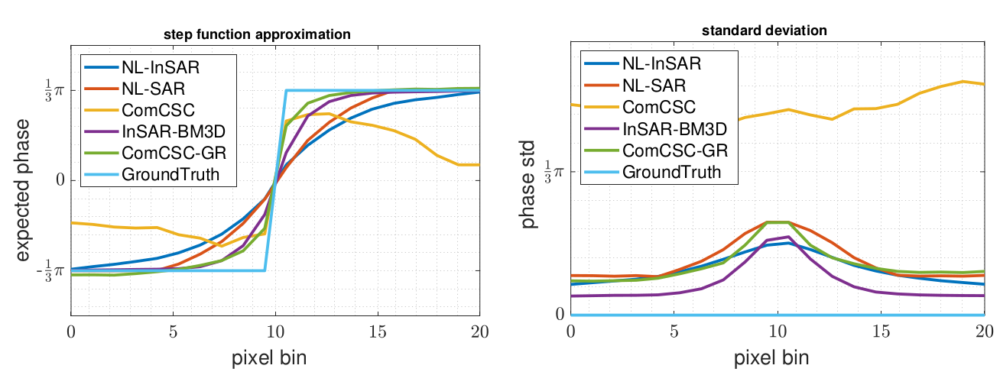

# Learning Convolutional Sparse Coding on Complex Domain for Interferometric Phase Restoration

[Jian Kang](https://github.com/jiankang1991), [Danfeng Hong](https://sites.google.com/view/danfeng-hong), [Jialin Liu](https://www.math.ucla.edu/~liujl11/), [Gerald Baier](https://www.geoinformatics2018.com/member/geraldbaier/), [Naoto Yokoya](https://naotoyokoya.com/), [Begüm Demir](https://begumdemir.com/)

---

This repo contains the codes for the TNNLS paper. we propose a complex convolutional sparse coding (ComCSC) algorithm and its gradient regularized version (ComCSC-GR) for interferometric phase restoration. Our method outperforms the state-of-the-art methods. The codes are modified from [SPORCO](http://brendt.wohlberg.net/software/SPORCO/) for adapting to complex images.


**10, 000 Monte-Carlo simulations for evaluating the compared methods on the expected values and standard deviations of step function approximation. The amplitude is constant and the coherence value is set as 0.3.**


## Citation
```
@article{kang2020comcsc,
  title={{Learning Convolutional Sparse Coding on Complex Domain for Interferometric Phase Restoration}},
  author={Kang, Jian and Hong, Danfeng and Liu, Jialin and Baier, Gerald and Yokoya, Naoto and Demir, Begüm},
  journal={IEEE Transactions on Neural Networks and Learning Systems},
  year={2020},
  publisher={IEEE}
}

@article{wohlberg2015efficient,
  title={Efficient algorithms for convolutional sparse representations},
  author={Wohlberg, Brendt},
  journal={IEEE Transactions on Image Processing},
  volume={25},
  number={1},
  pages={301--315},
  year={2015},
  publisher={IEEE}
}

@article{liu2018first,
  title={First-and second-order methods for online convolutional dictionary learning},
  author={Liu, Jialin and Garcia-Cardona, Cristina and Wohlberg, Brendt and Yin, Wotao},
  journal={SIAM Journal on Imaging Sciences},
  volume={11},
  number={2},
  pages={1589--1628},
  year={2018},
  publisher={SIAM}
}

```
